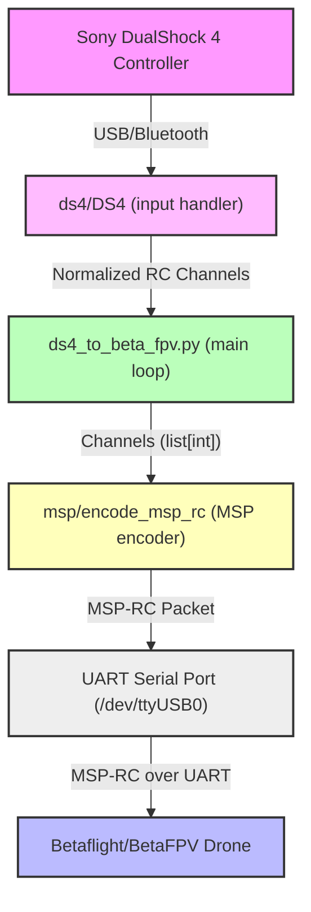

# DS4toBetaFPV-Py

**A fast Python bridge between a Sony DualShock 4 controller (Bluetooth/USB) and a Betaflight/BetaFPV drone via MSP-RC over UART.**

> **Note:** This project can also be run on a **Raspberry Pi** (any model with USB and UART), making it possible to use the Pi as a compact, wireless bridge between your DualShock 4 and a BetaFPV drone.

---

## Table of Contents

1. Overview
2. Architecture (with diagram)
3. Installation
4. Usage
5. Configuration
6. Project Structure
7. Technical Details
8. Dependencies
9. FAQ / Troubleshooting
10. Raspberry Pi Setup

---

## 1. Overview

This project allows you to control a Betaflight/BetaFPV drone using a Sony DualShock 4 controller. It converts gamepad inputs into RC commands using the MSP protocol, sent over a UART serial port to your flight controller.

- **Works on any Linux PC or Raspberry Pi** (including Pi Zero, Pi 3/4/5)
- **Ideal for portable, wireless ground stations**

---

## 2. Architecture



---

## 3. Installation

### Prerequisites

- Python 3.7+
- Linux (recommended, for access to `/dev/input/js*` and `/dev/ttyUSB*`)
- Sony DualShock 4 controller (USB or Bluetooth)
- Root access (for device access)
- **Raspberry Pi:** Any model with USB and UART (Pi Zero, Pi 3, Pi 4, Pi 5, etc.)

### Automatic Installation

```bash
git clone https://github.com/your-username/DS4toBetaFPV-Py.git
cd DS4toBetaFPV-Py
./scripts/install.sh
```

---

## 4. Usage

### Quick Start

```bash
sudo ./scripts/run.sh
```

- By default, uses `/dev/input/js0` and `/dev/ttyUSB0`.
- To specify other devices:
  ```bash
  sudo ./scripts/run.sh /dev/input/js1 /dev/ttyUSB1
  ```

### Manual Run

```bash
source venv/bin/activate
sudo python3 ds4_to_betafpv.py --js /dev/input/js0 --serial /dev/ttyUSB0
```

> **Raspberry Pi Note:**
> - You can use the Pi's built-in UART (e.g., `/dev/serial0` or `/dev/ttyAMA0`) to connect directly to the flight controller's UART RX/TX pins.
> - For Bluetooth, pair the DualShock 4 with the Pi using `bluetoothctl`.
> - For USB, just plug the controller into the Pi.

---

## 5. Configuration

The `config.yaml` file lets you map axes/buttons and tune stick response.

```yaml
channels:
  roll:     "axis:0"
  pitch:    "axis:1,negate"
  throttle: "axis:3"
  yaw:      "axis:2"
aux1: "button:0"   # cross  -> arm
aux2: "button:3"   # square -> angle mode

expo: 0.2
deadband: 5
```

- **channels**: maps controller axes to RC channels.
- **aux1/aux2**: maps buttons to auxiliary RC channels.
- **expo**: exponential on sticks (0 = linear).
- **deadband**: dead zone around center (in %).

---

## 6. Project Structure

```
DualShocktoBetaFPV-Py/
│
├── config.yaml
├── ds4_to_beta_fpv.py         # Main script
├── requirements.txt
├── README.md
├── LICENSE
│
├── ds4/
│   ├── __init__.py
│   ├── ds4.py                 # DS4 gamepad handler
│   └── mapping.py             # Axis/button mapping parser
│
├── msp/
│   ├── __init__.py
│   └── msp.py                 # MSP-RC protocol encoder
│
└── scripts/
    ├── install.sh             # Automatic install
    └── run.sh                 # Quick launcher
```

---

## 7. Technical Details

- **ds4/ds4.py**: Reads gamepad events, applies mapping/config, normalizes values for RC protocol.
- **msp/msp.py**: Encodes 8 RC channels in MSP_SET_RAW_RC (id 200) format for Betaflight.
- **ds4_to_beta_fpv.py**: Main loop, reads gamepad, encodes and sends commands to FC via UART.
- **scripts/install.sh**: Installs Python, venv, dependencies.
- **scripts/run.sh**: Runs the main script with sudo and correct arguments.

---

## 8. Dependencies

- `pyyaml>=6.0`
- `pyserial>=3.5`

---

## 9. FAQ / Troubleshooting

- **Q: The script doesn't detect my controller?**
  - Check that `/dev/input/js0` exists (`ls /dev/input/js*`).
  - Test the controller with `jstest /dev/input/js0`.

- **Q: Serial port access issues?**
  - Make sure your user has permissions for `/dev/ttyUSB0` (or `/dev/serial0` on Pi).
  - Try running with `sudo`.

- **Q: How do I change the mapping?**
  - Edit `config.yaml` as needed (see configuration section).

---

## 10. Raspberry Pi Setup

**Hardware:**
- Any Raspberry Pi with USB and UART (Pi Zero, Pi 3, Pi 4, Pi 5, etc.)
- Connect the Pi's UART TX/RX pins to the RX/TX of your flight controller (consult BetaFPV/Betaflight wiring guides)
- Use a logic level shifter if your FC is not 3.3V tolerant

**Software:**
- Use the same installation and usage steps as above
- For Bluetooth, pair the controller using `bluetoothctl`
- For UART, use `/dev/serial0` or `/dev/ttyAMA0` as the `--serial` argument

**Example:**
```bash
sudo ./scripts/run.sh /dev/input/js0 /dev/serial0
```

---

**Happy flying!**
